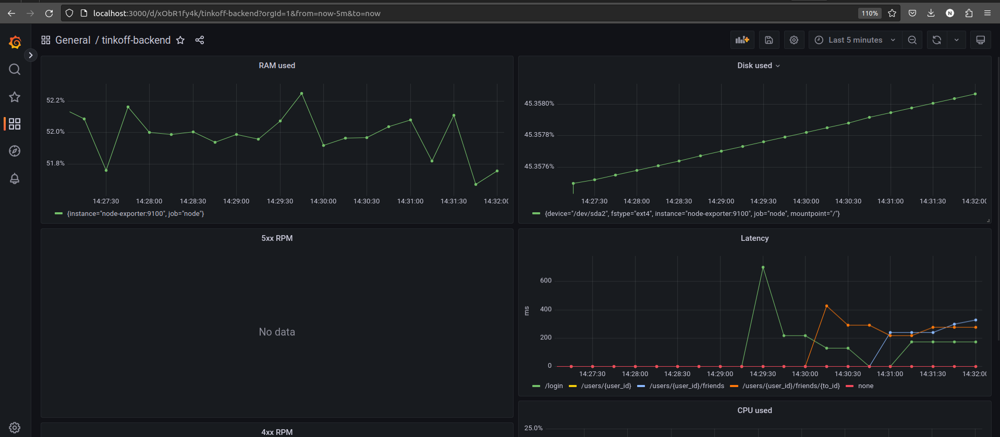
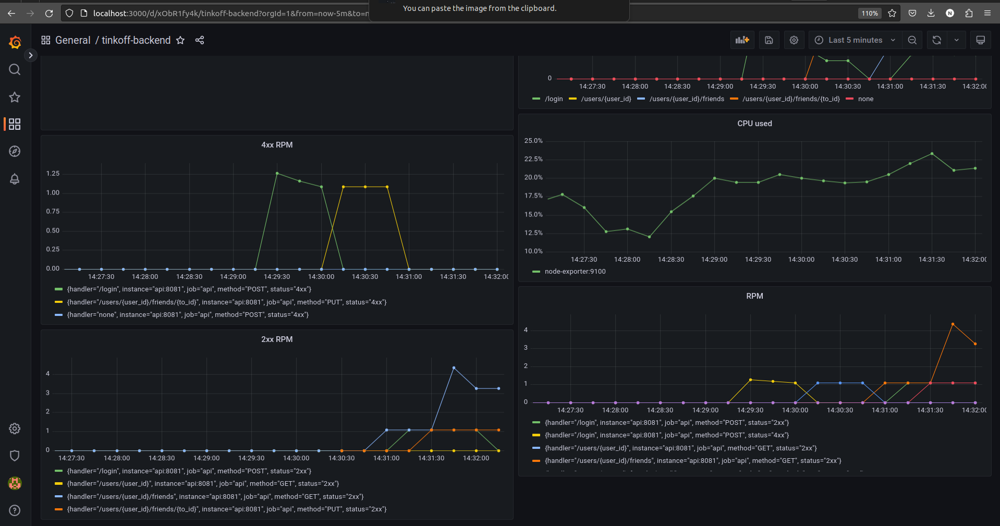
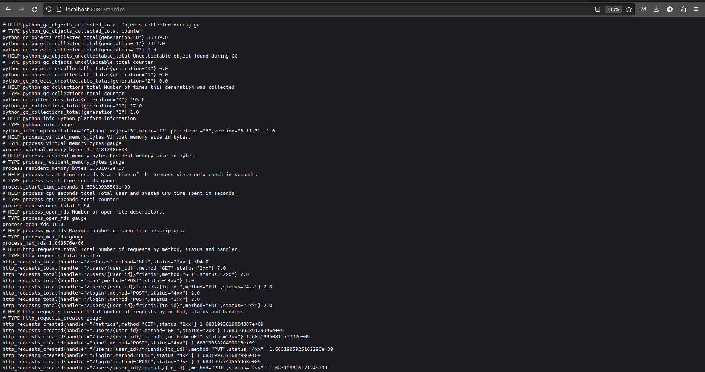

#### Удалена ручка GET /users (хэндлер get_all_users), поскольку возвращать 1млн+ пользователей очень долго и затратно ####

---
#### Отчет о метриках ####

Сервер работает на порту <code>8081</code>

Все доступные команды находятся в [Makefile](Makefile).
